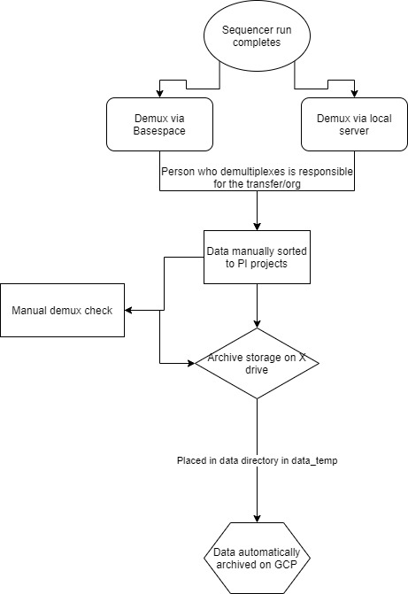
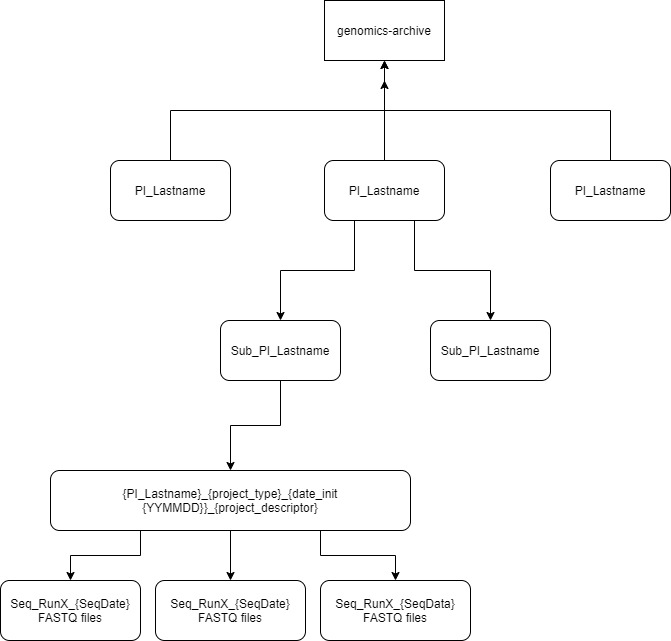

# Cloud Archive Storage Policy
All sequencing runs shall have an applicable data storage surcharge. This shall be scaled based upon the [average data output per Illumina flow cell](https://support.illumina.com/bulletins/2018/01/approximate-sizes-of-sequencing-run-output-folders.html). All data shall be stored in "hot" storage for 1-3 months (per project facilitator), followed by cold archival storage to meet the NIH 5 year data retention policy. 

## Pricing
Pricing is based on [Google Cloud Platform pricing](https://cloud.google.com/products/calculator) with the time frame detailed above. 

Flow cell | Cost for data storage  
--- | --- 
MiSeq flow cell | $10
NextSeq Mid Output | $25 
NextSeq High Output | $75
NovaSeq SP | $75
NovaSeq S1 | $125
NovaSeq S2 | $250
NovaSeq S4 | $750

## Opting out
All investigators have the option to opt out of cloud data storage and not pay the data storage surcharge. This must be declared at project onset during project quotation. If investigators opt for this route, they must sign off accepting data responsibility and the Core will purge **all** data after 3 months local storage. Data will be transferred to the investigator prior to data deletion, and can be transferred via FTP (investigator must have storage space available), or a physical external hard drive will be purchase (at investigator's expense) with data provided on the hard drive. If the investigator does not make a reasonable attempt to download the data or agree to an external hard drive, the opt out will be void and they will be charged the cloud storage surcharge. 

## Operation
Execution of the data management and archiving is the responsibility of the lab member performing the demultiplexing, and will follow the workflow below:
- Demultiplex data via BaseSpace or local server
- Manually validate the demultiplexing
    - Ensure no barcode mixups and correct raw data depth
- Transfer/Organize the data
    - Contact the project investigator, determine if investigator wishes to keep BCL files or purge
        - If investigator is keeping the BCL files, immediately transfer to their storage capacities with notes that local copies will be destroyed
        - If purging or once transfer to investigator is complete, move BCL files to X drive for temporary storage. Once storage capacities approach limits, BCLs will be purged starting from the oldest data
    - FASTQ files will be transferred to analyzing party
        - MD5 checksums recommended for data integrity
        - If investigator wishes for FASTQ data, immediately transfer to their storage capacities as well. 
        - FASTQs will be organized per the archive structure for automated upload to GCP backup
            - It is recommended to include the final sample sheet and run parameters files
- Automated transfer
    - On a TBD basis, all files in the GENOMICS_DATA_ARCHIVE directory will be uploaded to GCP. 
    - Files will be uploaded following the directory structure outlined below
    - Upon upload, all files will be validated for integrity with MD5 checksums
    - All files with successful transfer will be deleted from local directory
    - The directory structure is to remain intact to provide parity and secondary additions to the GCP structure. 

## Directory Structure
The GENOMICS_DATA_ARCHIVE and GCP resources shall be stored in the same directory structure as shown below. 
- The first layer is the primary PI's last name.
- The second layer is for the end user's last name.
    - If the end user is the primary PI, then the directory would look like /lemenze/lemenze/
    - For CO-PI projects, one PI must be chosen as the primary, and the secondary can be used as the end user if necessary
- The third layer is the project directory. This will be using the format of {PI_lastname}_{project_type}_{date_init{YYMMDD}}_{project_descriptor}
    - Example: Lemenze_RNAseq_170514_RickettsiaDrugResponses
- The final layer is the fastq directories themselves. If the project has only a single sequencer run, then the directory can be simply "FASTQS". Otherwise, it should be split by sequencing run with the sequencing date captured in each directory name. 
    - If the storage expands, we can also easily add an "Analysis" folder to each directory in this layer. 

